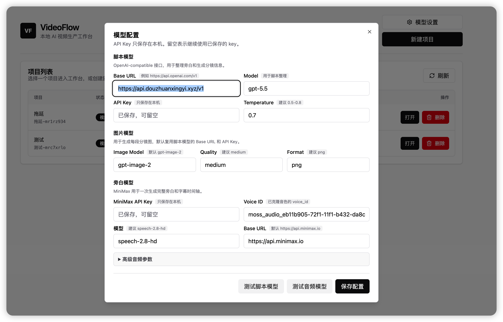
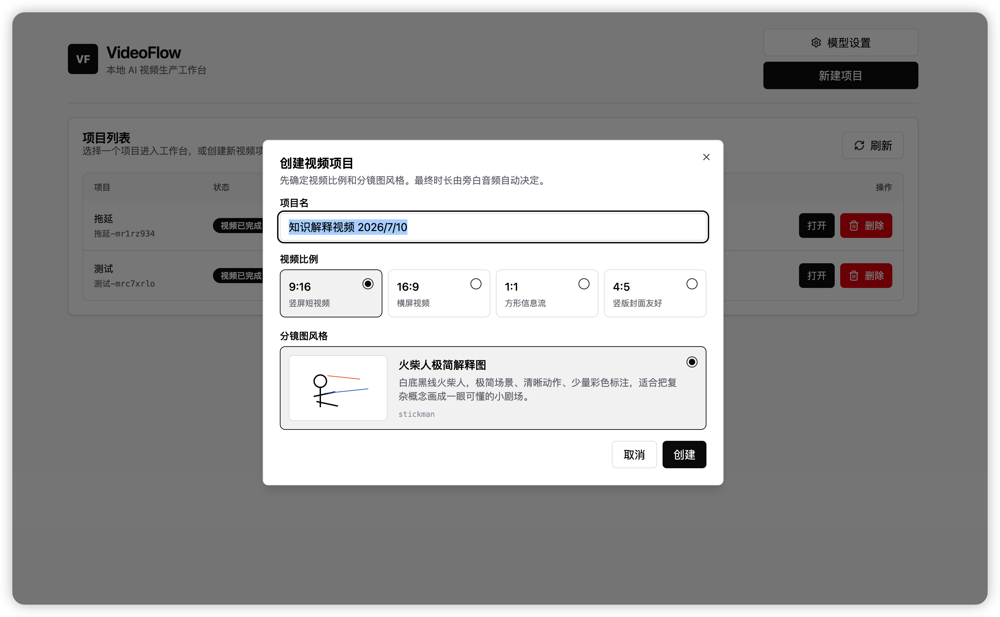
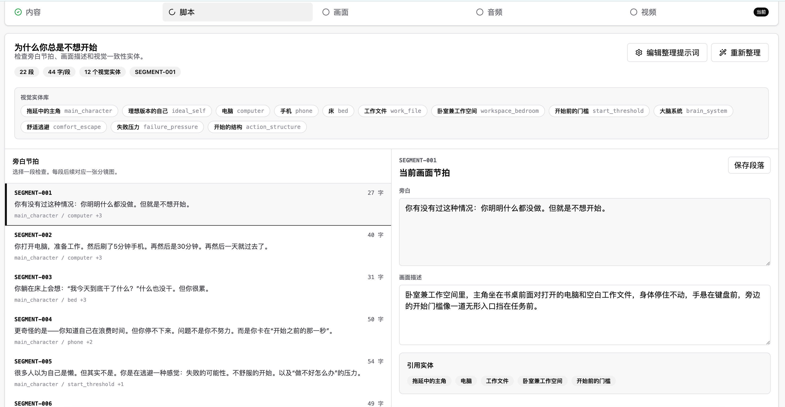
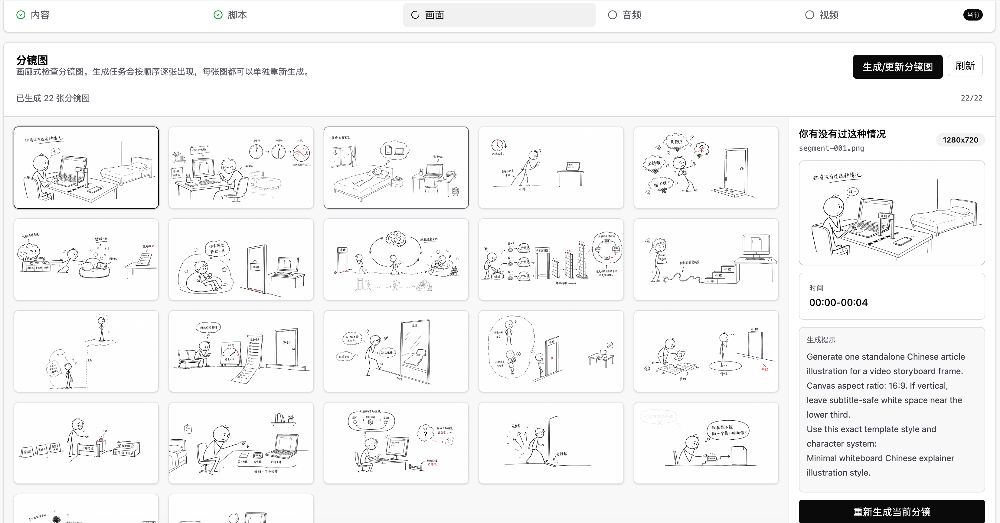
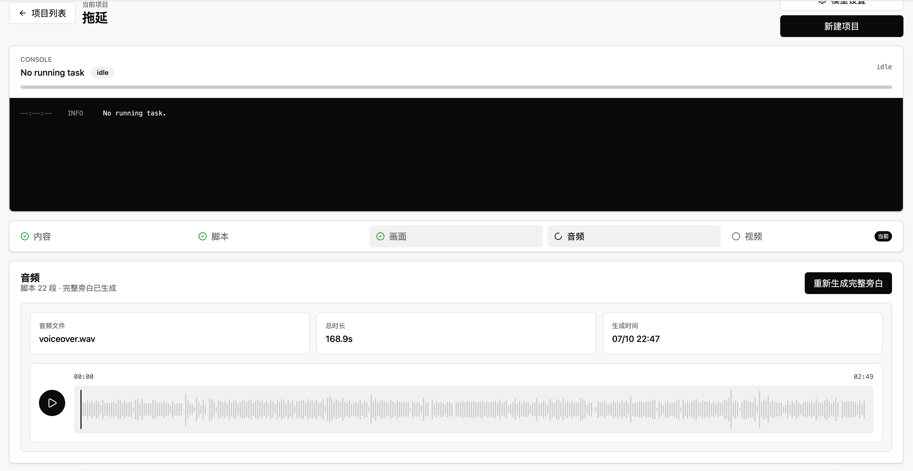
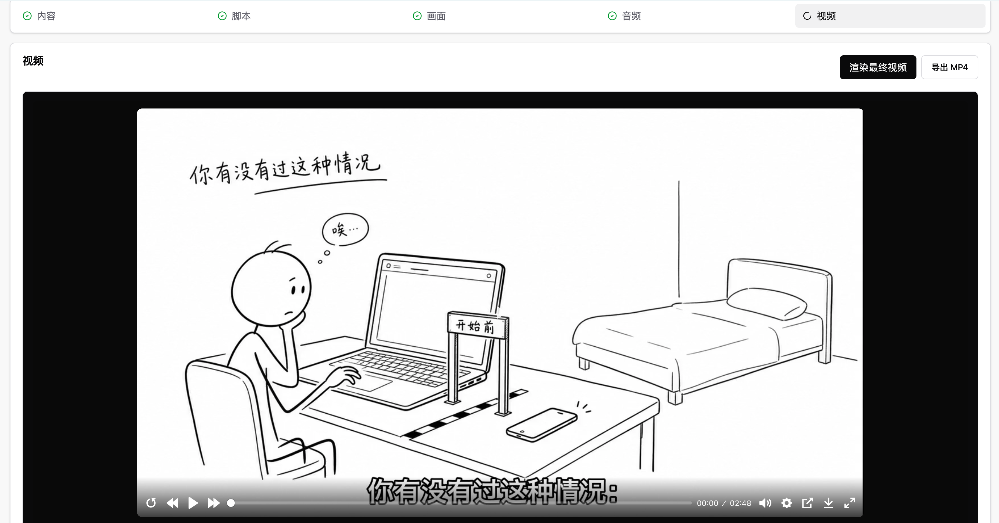

# VideoFlow
https://github.com/user-attachments/assets/a8cfef1f-784a-48f8-856d-9cdee878d91f

VideoFlow 是一个本地运行的 AI 视频生产工作台，用来把一段已经写好的中文旁白，自动整理成可生产的视频项目：大模型整理脚本，ChatGPT Image / OpenAI-compatible 图片模型生成分镜图，MiniMax 生成完整旁白音频和字幕时间轴，最后用 FFmpeg 合成为 MP4。

它适合制作讲书、知识解释、口播配图、白板解释、短视频分镜等内容。应用本身只在本机运行，API Key 只保存在 `app-config.local.json`，该文件已被 `.gitignore` 忽略，不会提交到仓库。

## 它做什么

VideoFlow 的核心思路是把“视频生产”拆成几个稳定步骤：

1. 输入已经写好的旁白文本。
2. 使用 OpenAI-compatible 对话模型清洗文本、拆分 segment、生成每段画面描述。
3. 使用图片模型为每个 segment 生成一张分镜图。默认配置面向 ChatGPT Image / `gpt-image-2`，也可以替换成兼容接口支持的图片模型。
4. 使用 MiniMax TTS 一次性生成完整旁白音频，而不是每段单独拼接。
5. 使用 MiniMax 返回的字幕或本地兜底逻辑生成 `captions.vtt`、`timings.json` 和渲染时间轴。
6. 使用 FFmpeg 把分镜图、旁白、字幕和可选 BGM 合成为最终 MP4。

## 功能

- 项目管理：每条视频一个独立项目目录，方便回看、修改和复渲染。
- 多比例视频：支持 `9:16`、`16:9`、`1:1`、`4:5`。
- 脚本整理：保留原始旁白表达，清理多余格式，并拆成适合配音和配图的 segment。
- 分镜规划：为每段生成视觉描述，并维护跨分镜一致的 visual bible。
- AI 生图：按 segment 生成分镜图，单张失败或不满意时可以单独重新生成。
- 完整旁白：使用 MiniMax 一次生成完整 `voiceover.wav`，同时得到字幕和时间轴。
- 音频预览：生成后可在页面内试听完整旁白。
- 视频渲染：使用 FFmpeg 合成图片、旁白、字幕和可选 BGM，输出 `renders/final.mp4`。
- 模板系统：通过 `templates/<template-id>/` 添加不同的视觉风格。
- 本地配置：API Key、模型和 FFmpeg 路径都保存在本机配置文件中。

## 技术流程

```text
旁白文本
  ↓
OpenAI-compatible 对话模型
  - 清理旁白
  - 拆分 segment
  - 生成 visual description
  - 生成 visual bible
  ↓
ChatGPT Image / gpt-image-2
  - 每个 segment 生成一张分镜图
  ↓
MiniMax TTS
  - 生成完整 voiceover.wav
  - 生成字幕/时间轴
  ↓
FFmpeg
  - 图片 + 旁白 + 字幕 + BGM
  - 导出 final.mp4
```

## 环境要求

- Node.js 20 或更高版本
- npm
- `PATH` 中可用的 FFmpeg 和 FFprobe
- 用于脚本整理和图片生成的 OpenAI-compatible API Key
- 用于旁白生成的 MiniMax API Key 和 voice ID

如果要在最终视频里烧录字幕，FFmpeg 必须支持 `subtitles` 滤镜，通常需要启用 `libass`。可以这样检查：

```bash
ffmpeg -hide_banner -filters | grep subtitles
```

如果 FFmpeg 不在 `PATH` 中，或者你有多个 FFmpeg 版本，可以通过环境变量指定：

```bash
export FFMPEG_PATH=/absolute/path/to/ffmpeg
export FFPROBE_PATH=/absolute/path/to/ffprobe
```

也可以写入本地配置文件 `app-config.local.json`：

```json
{
  "ffmpegPath": "/absolute/path/to/ffmpeg",
  "ffprobePath": "/absolute/path/to/ffprobe"
}
```

## 快速开始

```bash
npm install
cp app-config.example.json app-config.local.json
npm run dev
```

打开：

```text
http://127.0.0.1:5173
```

你也可以直接在应用里的“模型设置”弹窗中配置模型。保存后的配置会写入本机的 `app-config.local.json`。

## 模型配置

`app-config.local.json` 不会提交到 git。首次使用可以复制 `app-config.example.json` 作为模板。

主要字段：

- `baseUrl`：OpenAI-compatible API 地址，例如 `https://api.openai.com/v1`。
- `model`：用于整理脚本的对话模型。
- `apiKey`：用于脚本整理和图片生成的 API Key。
- `ffmpegPath`：可选，指定 FFmpeg 路径。
- `ffprobePath`：可选，指定 FFprobe 路径。
- `image.model`：图片生成模型，默认示例为 `gpt-image-2`。
- `image.quality`：图片质量，默认 `medium`。
- `image.outputFormat`：图片格式，默认 `png`。
- `audio.minimaxApiKey`：MiniMax API Key。
- `audio.minimaxGroupId`：可选的 MiniMax Group ID。
- `audio.minimaxModel`：MiniMax TTS 模型。
- `audio.minimaxVoiceId`：MiniMax voice ID。
- `audio.minimaxSpeed`：语速。
- `audio.minimaxVolume`：音量。
- `audio.minimaxPitch`：音调。

## 网站使用教程

下面按网页里的实际顺序走一遍完整工作流。截图来自本地示例项目，只用于说明界面；项目内容、模型名称和服务地址以你的本机配置为准。

### 1. 配置模型

第一次使用先点击首页右上角的“模型设置”，配置脚本模型、图片模型和 MiniMax 旁白模型。API Key 只保存在本机的 `app-config.local.json` 中，不要提交这个文件。



关键项：

- 脚本模型：OpenAI-compatible Chat Completions 接口，用来整理旁白、拆 segment、生成画面描述和 visual bible。
- 图片模型：用于按每个 segment 生成分镜图，默认使用 `gpt-image-2`。
- 旁白模型：MiniMax TTS，用一个 voice ID 一次性生成完整旁白和字幕时间轴。
- 测试按钮：保存配置前，可以分别检查脚本模型和音频模型是否连通。

### 2. 新建项目

点击“新建项目”，输入项目名，选择视频比例和分镜图风格。视频时长不需要填写，后续会由旁白音频自动决定。



比例建议：

- `9:16`：短视频竖屏。
- `16:9`：横屏视频、B 站、YouTube。
- `1:1` / `4:5`：信息流或封面友好内容。

模板决定图片提示词的整体风格，例如当前内置的 `stickman` 是白底黑线火柴人解释图。

创建完成后，项目会出现在首页列表中。你可以打开已有项目、刷新列表或删除不再需要的项目。所有生成文件都保存在 `projects/<project-id>/` 下。

### 3. 粘贴旁白并开始整理

进入项目后，先在“内容”页粘贴已经写好的完整中文视频旁白，然后点击“开始整理”。

当前逻辑不会替你重写成另一篇稿子，而是尽量保留你的原文，只做清理、去重、拆分和画面规划。建议输入的是可以直接配音的旁白，而不是只有资料摘要或大纲。

### 4. 检查脚本和视觉实体库

整理完成后进入“脚本”页。这里主要检查三件事：旁白节拍、画面描述、视觉实体库。



页面含义：

- 旁白节拍：每个 `SEGMENT` 后续对应一张分镜图。
- 画面描述：当前 segment 应该如何被一张静态图表达。
- 视觉实体库：大模型分析出的反复出现角色、物品、场景和符号，用来提高多张图之间的一致性。
- 保存段落：如果你手动改了某段旁白或画面描述，需要保存。
- 重新整理：用当前内容源重新让大模型拆分和规划，已有后续产物可能需要重新生成。

判断脚本是否合格时，重点看每段旁白是否能被“一张图”完整表达。如果一段里有两个不同场景或两个不同隐喻，应该重新整理或手动拆开。

### 5. 生成和检查分镜图

进入“画面”页，点击“生成/更新分镜图”。图片会按分镜逐张出现。每张图都可以单独重新生成。



检查重点：

- 图是否和当前旁白段匹配。
- 主角、重要物品、符号是否和视觉实体库一致。
- 画面比例是否正确，内容是否完整显示。
- 不满意单张图时，用右侧“重新生成当前分镜”，不要整批重来。

如果有缺失分镜，页面会提示缺失数量，可以只生成缺失项。

### 6. 生成完整旁白

进入“音频”页，点击“生成完整旁白”。MiniMax 会一次性生成完整 `voiceover.wav`，并返回字幕/时间轴信息。



生成后可以直接在页面里试听完整旁白。当前设计不是每段单独生成再拼接，这样能减少段落之间音色、语气和语速不连续的问题。

### 7. 渲染最终视频

进入“视频”页，检查播放器和视频设置。设置只影响下一次渲染，不会修改已经生成的 `final.mp4`。



可调设置：

- 开启字幕：把旁白字幕烧录进最终视频。
- 字幕位置：顶部、中部、底部。
- 混入 BGM：使用 `assets/bgm.mp3` 作为默认背景音乐。
- 整体速度：对最终视频和音频一起加速。

点击“渲染最终视频”后，会输出：

```text
projects/<project-id>/renders/final.mp4
```

也可以直接点击页面里的“导出 MP4”下载或打开成片。

## 输出目录

生成文件会写入：

```text
projects/<project-id>/
  project.json
  source.md
  segments.json
  script.json
  visual-bible.json
  render-plan.json
  storyboards/
  storyboards.json
  voiceover.wav
  captions.vtt
  timings.json
  captions-timeline.json
  minimax-subtitles.json
  renders/
    captions.ass
    silent.mp4
    final.mp4
```

`projects/` 目录默认被 git 忽略，只保留说明文件和占位文件。

## 视觉模板

视觉模板位于：

```text
templates/<template-id>/
  template.json
  image-style.md
```

当前内置模板：

- `stickman`：极简白板中文解释图风格。

模板元数据和提示词编写方式见 `templates/README.md`。

## BGM 和字体

应用会在开启 BGM 时读取 `assets/bgm.mp3`。发布或分发成片前，请确认你有权使用该音频。

字幕渲染可以使用 `assets/fonts/` 中的可选字体文件。不要提交没有再分发授权的系统字体或商业字体。

## 常用脚本

```bash
npm run dev          # 构建前端并启动本地服务
npm run start        # 使用已有前端构建产物启动服务
npm run check        # 检查前端类型和后端语法
npm run client:dev   # 启动前端 Vite 开发服务
npm run client:build # 构建前端
```

发布 fork 或提交修改前，建议阅读 `CONTRIBUTING.md` 和 `SECURITY.md`。

## 健康检查

启动服务后可以检查运行环境：

```bash
curl http://127.0.0.1:5173/api/health
```

该接口会返回 FFmpeg、FFprobe、MiniMax 配置和 BGM 是否可用。

## 常见问题

### 渲染视频时报 `No such filter: 'subtitles'`

说明当前 FFmpeg 不支持 `subtitles` 滤镜。要么换成启用了 `libass` 的 FFmpeg，要么在视频页关闭“开启字幕”后重新渲染。

### 生成了音频但页面没出现

先刷新页面。如果项目目录中已经有 `voiceover.wav`，但页面仍不显示，通常是前端没有拿到最新项目状态。

### 可以只用自己的图片或音频吗？

当前工作流默认由模型生成分镜图和完整旁白。你可以直接替换项目目录中的产物，但要保证 `storyboards.json`、`timings.json`、`voiceover.wav` 等文件仍然匹配。

## 许可证

MIT
